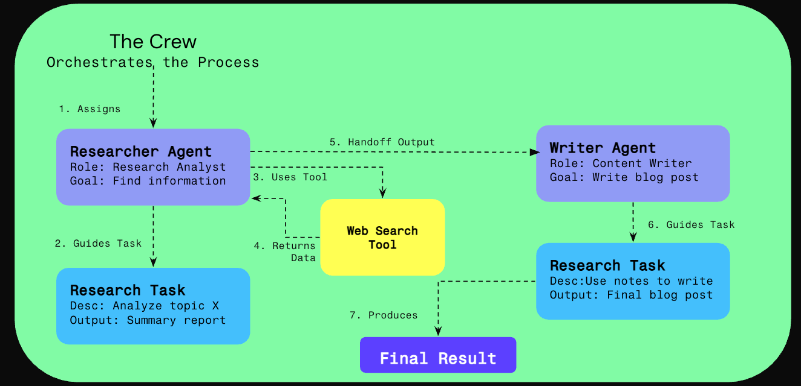

# Building Your First AI Crew with crewAI (The Modern Way)

## 1. Introduction & Lab Goals

Welcome to the next step in your AI agent journey! This notebook will guide you through using **crewAI**, a sophisticated framework designed to orchestrate multiple AI agents. We will be using the latest, most streamlined method for connecting to Large Language Models (LLMs).

Our goal is to build a simple **Research Crew** multi-agent workflow that researches a topic and writes a report.

The logic flow will look like this:




## 2. Prerequisites

* **Knowledge:** Basic understanding of Python programming.
* **API Key and Datarobot Endpoint:** This lab is configured for **Datarobot LLM Gateway**. For external IDE use, you will need a datarobot API credentials, and Datarobot API endpoint. You can set these environment variables, as indicated below.   
* **Python Version:** These labs are intended to be run on `python 3.11` or `python 3.12.` Others may work, but are untested.

## 3. Step-by-Step Guide

### Step 1: Project Setup and Installation

First, let's install the necessary libraries. We'll include `ddgs` for web search capabilities (updated package name).

```bash
# Install uv if you haven't already
# pip install uv

# Install requirements
uv pip install -r ../requirements.txt
```

### Step 2: DataRobot LLM Gateway Setup
### First, we will connect to the Datarobot LLM Gateway and list the available LLMs.
The code below will connect to ANY of the LLMs hosted in the Datarobot LLM Gateway. For direct connections to external or customer hosted LLMS, you'll need to populate accordingly.

```python
import datarobot as dr
import os
from dotenv import load_dotenv
from pprint import pprint


load_dotenv('../.env') #use only with local IDE

import openai
#grab dr client credentials from os environment variables
#dr_client = dr.Client() #use in datarobot notebooks w/o credentials
dr_client = dr.Client(endpoint=os.getenv('DATAROBOT_ENDPOINT'), token=os.getenv('DATAROBOT_API_TOKEN')) #use for external IDE w/ environment variable credentials.

#set LLM Gateway
DR_API_TOKEN = dr_client.token
LLM_GATEWAY_BASE_URL = f"{dr_client.endpoint}/genai/llmgw"
response = dr_client.get(url="genai/llmgw/catalog/")
catalog = response.json()["data"]

response = dr_client.get(url="genai/llmgw/catalog/")
data = response.json()["data"]
supported_llms = [llm_model["model"] for llm_model in data]

print("These are list of LLMs supported by the Datarobot LLM Gateway:")
pprint(supported_llms)
```

### Next, we are going to choose a random entry from the list of LLMS that was returned:

```python
client = openai.OpenAI(
    api_key=dr_client.token,
    base_url=dr_client.endpoint + "/genai/llmgw"
)

# We are going to select a RANDOM model from the list above... feel free to hard code your preference!!!
#model = random.choice(supported_llms)
model = 'bedrock/mistral.mixtral-8x7b-instruct-v0:1'
#model = 'bedrock/meta.llama3-70b-instruct-v1:0'
response = client.chat.completions.create(
    model=model,
     messages= [
    {
      "role": "user",
      "content": f"Who are you? {model}"
    }
  ]
)
pprint(model)
pprint(response.choices[0])
```

### Step 3: Create a Custom DuckDuckGo Search Tool

Since the CrewAI DuckDuckGoSearchRunTool is not available in the current version, we'll create our own custom search tool using the `duckduckgo-search` library directly.

```python
from crewai.tools import BaseTool
from pydantic import BaseModel, Field
from typing import Type
from ddgs import DDGS
from datetime import datetime
import json

class SearchInput(BaseModel):
    """Input schema for DuckDuckGo search tool."""
    query: str = Field(..., description="The search query")

class DuckDuckGoSearchTool(BaseTool):
    name: str = "duckduckgo_search"
    description: str = "Search the web using DuckDuckGo for current information"
    args_schema: Type[BaseModel] = SearchInput

    def _run(self, query: str) -> str:
        """Execute the search and return formatted results."""
        try:
            with DDGS() as ddgs:
                # Try news search first
                news_results = list(ddgs.news(query, max_results=5))
                
                if news_results:
                    formatted_results = []
                    formatted_results.append(f"Search Results for: {query}")
                    formatted_results.append(f"Search performed at: {datetime.now().strftime('%Y-%m-%d %H:%M:%S')}")
                    formatted_results.append("\n=== NEWS RESULTS ===")
                    
                    for i, result in enumerate(news_results, 1):
                        title = result.get('title', 'No title')
                        body = result.get('body', '')
                        url = result.get('url', '')
                        date = result.get('date', 'Recent')
                        
                        formatted_results.append(f"\n{i}. {title}")
                        if body:
                            # Truncate body to keep it manageable
                            body_snippet = body[:300] + "..." if len(body) > 300 else body
                            formatted_results.append(f"   Summary: {body_snippet}")
                        formatted_results.append(f"   Date: {date}")
                        formatted_results.append(f"   Source: {url}")
                    
                    return "\n".join(formatted_results)
                
                # If no news results, try regular web search
                web_results = list(ddgs.text(query, max_results=5))
                
                if web_results:
                    formatted_results = []
                    formatted_results.append(f"Search Results for: {query}")
                    formatted_results.append(f"Search performed at: {datetime.now().strftime('%Y-%m-%d %H:%M:%S')}")
                    formatted_results.append("\n=== WEB RESULTS ===")
                    
                    for i, result in enumerate(web_results, 1):
                        title = result.get('title', 'No title')
                        body = result.get('body', '')
                        url = result.get('href', '')
                        
                        formatted_results.append(f"\n{i}. {title}")
                        if body:
                            # Truncate body to keep it manageable
                            body_snippet = body[:300] + "..." if len(body) > 300 else body
                            formatted_results.append(f"   Summary: {body_snippet}")
                        formatted_results.append(f"   Source: {url}")
                    
                    return "\n".join(formatted_results)
                
                else:
                    return f"No search results found for: {query}"
            
        except Exception as e:
            return f"Search error for '{query}': {str(e)}"

# Create the search tool instance
search_tool = DuckDuckGoSearchTool()
print("✅ Custom DuckDuckGo search tool created successfully!")
```

### Step 4: Define the Crew

Now we define the agents and tasks. This is the heart of crewAI - creating specialized agents that can work together to accomplish complex goals.

**📚 For sample configuration, refer to the [CrewAI Research Lab Setup Guide](../CrewAI_ResearchLab_Setup.md)**

#### Key Components You'll Create:

1. **LLM Configuration** - Set up your connection to the DataRobot LLM Gateway
2. **Agents** - Define specialized AI workers with distinct roles and capabilities
3. **Tasks** - Create specific assignments for each agent to complete
4. **Crew** - Organize agents and tasks into a collaborative workflow

#### Understanding the Architecture:

- **Agent**: A specialized AI worker with a specific role (e.g., Researcher, Writer)
- **Task**: A specific job assigned to an agent with clear expectations
- **Tool**: Capabilities you give to agents (like our search tool)
- **Crew**: The orchestrator that manages agents and tasks in sequence

#### Important Configuration Notes:

- `verbose=True/False`: Controls output verbosity (set to False for DataRobot compatibility)
- `allow_delegation=True/False`: Whether agents can delegate tasks to other agents
- `custom_llm_provider="openai"`: Required for DataRobot LLM Gateway compatibility
- `process=Process.sequential`: Tasks execute one after another (vs. parallel)

**Complete and Run the code below to create your research crew:**
```python
#use this for troubleshooting endpoint and token issues
print(dr_client.token)
print(dr_client.endpoint + "/genai/llmgw")
```

```python
import os
from crewai import Agent, Task, Crew, Process, LLM

# --- LLM Configuration for DataRobot Gateway ---


llm = LLM(
    model=model,
    #model='vertex_ai/claude-3-7-sonnet@20250219',
    api_key=dr_client.token,
    base_url=dr_client.endpoint + "/genai/llmgw",
    custom_llm_provider="openai"  # Force liteLLM to treat this as OpenAI
)

# --- Agent & Task Definitions ---
# Define the Researcher Agent
researcher = Agent(
  role='Senior Research Analyst',
  goal='Uncover cutting-edge developments in AI and data science',
  backstory='''You work at a leading tech think tank.
  Your expertise lies in identifying emerging trends.
  You have a knack for dissecting complex data and presenting
  actionable insights.''',
  verbose=False,  # Set to False for DataRobot compatibility
  allow_delegation=False,
  tools=[search_tool],  # Using our custom search tool
  llm=llm  # Pass the LLM object, not a string
)

# Define the Writer Agent
writer = Agent(
  role='Tech Content Strategist',
  goal='Craft compelling content on tech advancements',
  backstory='''You are a renowned Content Strategist, known for
  your insightful and engaging articles.
  You transform complex concepts into compelling narratives.''',
  verbose=False,  # Set to False for DataRobot compatibility
  allow_delegation=True,
  llm=llm  # Pass the LLM object, not a string
)

# Create the Research Task
research_task = Task(
  description='''Conduct a comprehensive analysis of the latest advancements in AI for 2025.
  Identify key trends, breakthrough technologies, and potential industry impacts.
  Use the search tool to find recent information about AI developments.
  Your final answer MUST be a full analysis report.''',
  expected_output='A comprehensive 3-paragraph report on the latest AI advancements.',
  agent=researcher
)

# Create the Writing Task
writing_task = Task(
  description='''Using the research analyst\'s report, compose an engaging blog post.
  The post should be easy to understand, insightful, and positive in tone.
  Make it sound cool, avoid complex words so it doesn't sound like AI.
  Your final answer MUST be the full blog post of at least 4 paragraphs.''',
  expected_output='A 4-paragraph blog post on AI advancements, formatted in markdown.',
  agent=writer
)

# --- Crew Definition ---
crew = Crew(
  agents=[researcher, writer],
  tasks=[research_task, writing_task],
  process=Process.sequential,
  verbose=True
)

print("✅ Crew and tasks are defined and ready to run.")
```

### Step 5: Run Your AI Crew

With everything set up, let's kick off the crew's work. This will start the sequential process, and you will see the agents' thoughts and actions in the output below.

```python
result = crew.kickoff()

print("\n\n########################")
print("## Here is your crew's result:")
print("########################\n")
print(result)
```

## 6. Key Concepts & Next Steps

* **Agent:** A configurable, autonomous worker.
* **Tool:** A capability you give to an agent.
* **Task:** A specific, detailed assignment for an agent.
* **Crew:** The collaborative environment where agents and tasks are managed.

Feel free to modify the tasks, add new agents, or switch the LLM by changing the model string passed to the agents.

## 6. Testing the Search Tool

Let's test our custom search tool to make sure it works correctly:

```python
# Test the search tool directly
test_query = "latest AI developments coming in 2026"
test_result = search_tool._run(test_query)

print("=== SEARCH TOOL TEST ===")
print(f"Query: {test_query}")
print("\nResults:")
print(test_result[:5000] + "..." if len(test_result) > 5000 else test_result)
print("\n=== TEST COMPLETED ===")
```

## 7. What's Next?

Now that you've built your first AI crew, here are some ideas for extending and improving it:

* **Add more specialized agents** - Create agents for different domains (finance, technology, healthcare)
* **Implement different crew processes** - Try hierarchical or parallel workflows
* **Create custom tools** - Build tools that integrate with your specific APIs or databases
* **Add memory and context** - Implement persistent memory for your agents
* **Scale up** - Deploy your crew to handle larger workloads

Congratulations on building your first AI crew with crewAI! You now have the foundation to create sophisticated multi-agent systems that can tackle complex problems collaboratively.
```
